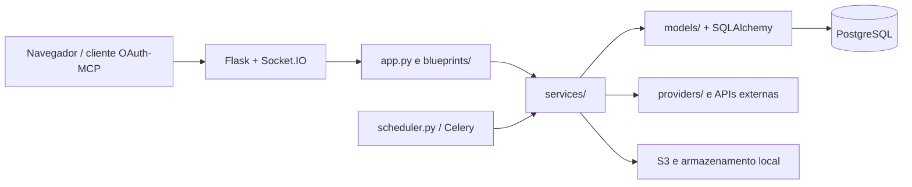

# Arquitetura do PetOrlândia

Este documento descreve a arquitetura que existe hoje e as fronteiras que devem
orientar novas alterações. Ele não substitui os guias operacionais específicos
em `docs/`.

## Visão geral

O PetOrlândia é uma aplicação Flask modularizada de forma incremental. O
bootstrap e algumas rotas legadas ainda vivem em `app.py`; domínios novos ou já
extraídos usam blueprints, serviços e modelos separados.



## Inicialização e processos

- `Procfile` executa migrações no release, inicia o web dyno por
  `app_factory:create_app()` e mantém o agendador em um processo separado.
- `app_factory.py` carrega a instância configurada e registra os blueprints de
  domínio de forma idempotente.
- `app.py` ainda cria a instância Flask, inicializa extensões e mantém rotas e
  compatibilidades legadas.
- `config.py` define os valores de configuração; `config_utils.py` concentra as
  transformações de bootstrap que podem ser testadas sem importar a aplicação.
- `extensions.py` possui as instâncias compartilhadas de SQLAlchemy, migrações,
  login, sessão, CSRF, limite de requisições, e-mail, compressão e logging.
- `request_hooks.py` registra request ID, políticas de cache e segurança,
  health checks e handlers globais de erro.

O agendador principal é `scheduler.py`. O agendador dentro de `app.py` existe
apenas como fallback local, habilitado explicitamente por
`ENABLE_WEB_SCHEDULER=1`. Tarefas fiscais assíncronas ficam em `app/jobs/` e usam
Celery quando o broker está configurado.

## Camadas e responsabilidades

| Camada | Local | Responsabilidade |
| --- | --- | --- |
| HTTP/UI | `blueprints/`, `app/routes/`, rotas legadas em `app.py` | Autenticação da requisição, validação de entrada e resposta |
| Casos de uso | `services/` | Regras de negócio, transações e coordenação de integrações |
| Persistência | `models/`, `repositories/` | Entidades SQLAlchemy e consultas reutilizáveis |
| Integrações | `providers/`, adaptadores em `services/` | Mercado Pago, fiscal, Google, S3 e outros serviços externos |
| Apresentação | `templates/`, `static/` | HTML, CSS, JavaScript e recursos visuais |
| Operação | `scripts/`, `scheduler.py`, `app/jobs/` | Migrações de dados, auditorias e processamento em segundo plano |

A direção preferida de dependência é `rota -> serviço -> modelo/repositório` e
`serviço -> provider`. Templates não devem conter regras de persistência, e
providers não devem depender de rotas.

## Registro de rotas e compatibilidade

`blueprint_utils.register_domain_blueprints()` é a lista canônica de blueprints.
Durante a migração gradual de `app.py`, `_register_with_alias()` mantém aliases de
endpoint usados por templates e redirects legados. Ao mover uma rota:

1. Preserve o endpoint público ou registre um alias compatível.
2. Rode `tests/test_route_registry.py` e `tests/test_url_map_contract.py`.
3. Só regenere `tests/url_map_snapshot.json` quando a mudança de URL for
   intencional e revisada.

## Dados, isolamento e segurança

PostgreSQL é o banco de produção; testes usam SQLite em memória. Migrações ficam
em `migrations/versions/`. Toda consulta de dados clínicos, financeiros ou
fiscais deve aplicar o escopo de clínica e as políticas de `access_control.py` e
`authz.py`. Recursos compartilhados entre clínicas devem passar pelos serviços
de autorização existentes, não por verificações de papel duplicadas na rota.

Os hooks globais aplicam CSRF, headers de segurança, respostas sem cache para
conteúdo autenticado e IDs de correlação. Segredos vêm de variáveis de ambiente;
o gate `scripts/check_sensitive_artifacts.py` deve continuar no CI.

## Estratégia de evolução

O principal débito estrutural é o tamanho de `app.py`. A migração deve ocorrer
por fatias verticais pequenas: extrair primeiro uma regra pura ou serviço,
adicionar testes, mover as rotas do mesmo domínio e preservar o contrato de URL.
Evite uma reescrita total do bootstrap, pois há compatibilidades de importação e
monkeypatch usadas pela suíte.

Novas funcionalidades devem nascer fora de `app.py`. Use um blueprint para HTTP,
um serviço para a regra de negócio e um provider para chamadas externas. Use
`db.session.get(Model, id)` para busca por chave primária; `Model.query.get()` é
uma API legada do SQLAlchemy 1.x.

## Validação mínima

```bash
python -m pytest tests/ -q -p no:cacheprovider
python scripts/check_sensitive_artifacts.py
python -m pytest tests/test_url_map_contract.py -q -p no:cacheprovider
```

O CI em `.github/workflows/tests.yml` é a referência final para versão do Python,
banco de teste e comandos obrigatórios.
